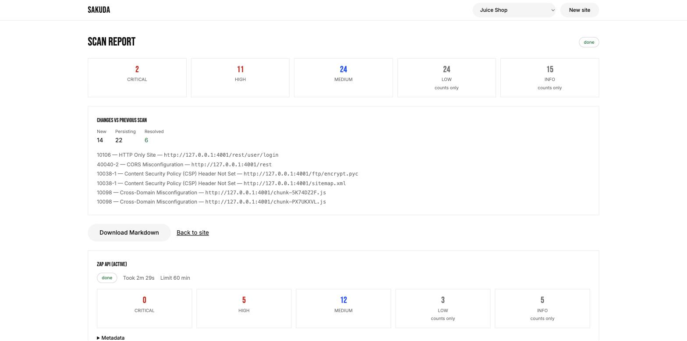
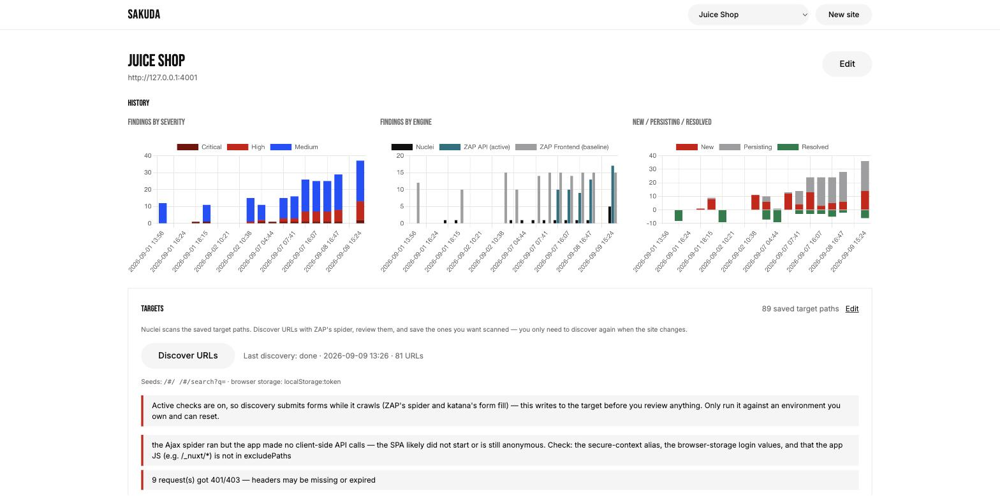

# sakuda

[English](README.md) | 日本語

**sakuda** は **「さくっとDAST」** の略 — できるだけ少ないセットアップで、役に立つ
セキュリティスキャンを回すことが狙いです。

**Docker イメージ 1 つ**で動く**セルフホスト型 DAST**（動的アプリケーションセキュリティ
テスト）Web アプリ脆弱性スキャナで、**OWASP ZAP**・**nuclei**・**katana**・**httpx**・
**dalfox** を **Nuxt** の UI の裏で動かします。各ツール単体では利用者任せになる部分 —
シングルページアプリの**認証付きスキャン**（ヘッダ注入 + ブラウザストレージのシード）、
**OpenAPI 駆動のアクティブスキャン**（ドキュメント化されたエンドポイントと、クロール結果
から生成した spec）、明示的なオプトインの裏に置いた **XSS / SQL インジェクション /
コマンドインジェクション**検査、前回スキャンとの差分・履歴チャート・Markdown 出力を
備えた誠実な**エンジン別レポート** — をカバーします。**自分が所有するターゲット**に
向けてください — OWASP Juice Shop のデモはコマンド 1 つで立ち上がります —
時間予算つきの有界なスキャンを実行し、何をカバーして何をカバーしなかったかを正確に
報告します。

**サイト**を登録し、**nuclei**、**ZAP API**（OpenAPI spec に対するアクティブスキャン）、
**ZAP frontend**（シードページからの spider + baseline）、**Dalfox**（有界な反射型 /
DOM XSS）でスキャンを実行し、結果を UI で閲覧します。**ディスカバリ**はスキャンとは
別工程です。ZAP の spider と katana がサイトをクロールし、見つかった URL をあなたが
確認して必要なものをターゲットパスとして保存し、nuclei は毎回その保存済みリストを
スキャンします — サイトが変わるまでクロールし直す必要はありません。

MVP のスコープ: サイト → スキャン → エンジン別レポート。意図的に外したものは
[この MVP に含まれないもの](#この-mvp-に含まれないもの)を参照。

**スキャンレポート** — 深刻度サマリ、前回スキャンとの差分、ステータス・実行時間・
制限時間を示すエンジン別パネル:



**サイトページ** — 検出結果の履歴（深刻度別・エンジン別・新規 / 継続 / 解消）、
保存済みターゲットリスト、ディスカバリパネル:



## カバレッジと限界

名前のとおり、sakuda は少ない手間でできるだけ多くを診断しようとします — しかし
**自動 DAST はすべての脆弱性を見つけられるわけではなく、クリーンなスキャン結果は
ターゲットが安全である証明にはなりません。** 各エンジンが能動的にテストするクラス
（インジェクション、設定不備、情報露出、リダイレクト）には強く、人間の推論が必要な
ものには盲目です:

- **ビジネスロジックと認可ワークフローの欠陥** — 価格改ざん、オブジェクトレベルの
  認可不備、複数ステップの悪用。ペイロードスキャナは意図を推論しません。
- **OSINT や文脈に依存するもの** — 推測可能な認証情報、漏えいしたシークレット、
  アプリを知っている人にしか意味のない情報。
- **カスタム nuclei テンプレートや手書きの OpenAPI spec がなければ到達できない
  クラス**、およびクロールが発見できなかったエンドポイント。
- **部分実行** — 制限時間に達したエンジンは _stopped at limit_ として報告されます。
  そこで検出がないことは、バグがないことではありません。

クリーンな結果は「この予算の範囲でこれらのエンジンが何も見つけなかった」と読んで
ください。sakuda は手動テストと組み合わせ、問題を素早く表面化させる用途に使い、
網羅性の保証としては使わないでください。

## クイックスタート (Docker)

アプリ、nuclei + テンプレート、ZAP のすべてが 1 つのイメージに入っています。
`docker-compose.yml` + `Makefile` がコマンドをラップし、ポートやシークレットはすべて
`.env` から読まれます。

```bash
make env      # .env.example から、新しい SAKUDA_ENCRYPTION_KEY 入りの .env を生成
make build    # イメージをビルド（初回は 10–20 分）
make up       # 起動 → http://localhost:3001
make logs     # ログを追う · make restart · make ps
make down && make up   # sakuda を作り直す（make build 後など）
make down     # sakuda だけ停止 — データボリュームと Juice Shop はそのまま
make juice-up && make juice-seed   # 任意: OWASP Juice Shop をすぐスキャンできるデモサイトとして用意（認証込み）
```

`make help` で全ターゲットを一覧できます。make を使わない場合:

```bash
docker compose up -d sakuda          # 同じこと。.env を読む
# または素の docker:
docker build -t sakuda .
docker run -d --name sakuda -p 127.0.0.1:3001:3000 --shm-size=1g \
  --add-host=host.docker.internal:host-gateway \
  -e SAKUDA_ENCRYPTION_KEY="$(openssl rand -base64 32)" \
  -v sakuda-data:/data \
  sakuda
```

### ポート

コンテナは常に **3000** で listen します。ホスト側のポートは `.env` から取るので、
他のローカルスタックと共存できます:

| `.env` 変数      | デフォルト  | 内容                                                                                  |
| ---------------- | ----------- | ------------------------------------------------------------------------------------- |
| `SAKUDA_PORT`    | `3001`      | sakuda UI/API（`make up`, `make dev`）                                                |
| `JUICESHOP_PORT` | `4001`      | OWASP Juice Shop のドライラン用ターゲット（`make juice-up`、別 compose プロジェクト） |
| `SAKUDA_BIND`    | `127.0.0.1` | 公開ポートのバインドアドレス — ループバックのみに保つこと                             |

呼び出しごとの上書きは `make up SAKUDA_PORT=3005` のように行います。

- **信頼モデル: sakuda に認証はありません。** ポートに到達できる人は誰でもサイト
  （設定済みヘッダを含む）の読み取り・作成・変更ができ、任意のホストに対して
  スキャンを開始できます。ループバックのみにバインドする（デフォルトの
  `SAKUDA_BIND=127.0.0.1`）か、認証付きリバースプロキシの裏に置いてください —
  共有ホストやインターネットに面したホストで `0.0.0.0` に公開してはいけません。
- **鍵を保管すること。** `SAKUDA_ENCRYPTION_KEY` は保存されたリクエストヘッダ
  （Cookie / Bearer など）を保管時に暗号化します。失うとそれらのヘッダは永久に
  読めなくなります — パスワードマネージャなど安全な場所に控えてください。データ
  ボリュームからは復元できません。
- **メモリ:** Docker Desktop に **6–8 GB** の RAM を割り当ててください — ZAP
  frontend エンジン（`zap-fe`）が最も消費し、それ未満では失敗するか OOM で kill
  されます。
- **ホストマシン上のターゲット URL**: サイトのベース URL が `http://localhost:PORT`
  （または `127.0.0.1`）のとき、sakuda はコンテナ内で動くエンジン向けに自動で
  `host.docker.internal` に書き換えます — コンテナを上記のように
  `--add-host=host.docker.internal:host-gateway` 付きで起動していれば追加設定は
  不要です。ZAP の Ajax spider が操る Firefox にも、このエイリアスを
  **secure context** として扱うよう指示します（`dom.securecontext.allowlist`）:
  平文 http で localhost でないオリジンには `crypto.randomUUID` / `crypto.subtle` /
  service worker がなく、認証の初期化でそれらに触る SPA は黙って失敗し、匿名訪問者
  としてクロールされてしまうためです。

## 環境変数

| 変数                              | デフォルト                                                 | 備考                                                                                                                                         |
| --------------------------------- | ---------------------------------------------------------- | -------------------------------------------------------------------------------------------------------------------------------------------- |
| `SAKUDA_ENCRYPTION_KEY`           | _(必須)_                                                   | ランダム 32 バイトの base64。`pnpm keygen` または `openssl rand -base64 32` で生成。                                                         |
| `SAKUDA_DATA_DIR`                 | `./data`（イメージ内は `/data`）                           | SQLite DB とスキャンごとの作業ディレクトリの置き場。                                                                                         |
| `SAKUDA_MIGRATIONS_DIR`           | `./server/db/migrations`（イメージ内は `/app/migrations`） | 起動時に適用される Drizzle マイグレーション。                                                                                                |
| `SAKUDA_NUCLEI_BIN`               | `nuclei`（イメージ内は `/usr/local/bin/nuclei`）           | nuclei バイナリのパス。                                                                                                                      |
| `SAKUDA_NUCLEI_TEMPLATES`         | `/opt/nuclei-templates/http`                               | ピン留めした nuclei-templates のチェックアウト。                                                                                             |
| `SAKUDA_NUCLEI_DAST_TEMPLATES`    | `/opt/nuclei-templates/dast`                               | DAST（ファジング）テンプレート。「アクティブインジェクション検査」が有効なサイトでのみ読み込まれる。                                         |
| `SAKUDA_NUCLEI_MAX_MINUTES`       | `60`                                                       | nuclei 1 実行のハードタイムアウト。全フェーズ（DAST / signature / OpenAPI）で共有。                                                          |
| `SAKUDA_NUCLEI_CONCURRENCY`       | `25`                                                       | nuclei の並列度（`-c`）。遅い・壊れやすいターゲットでは下げると、遅い応答待ちで浪費する時間が減る。                                          |
| `SAKUDA_KATANA_BIN`               | `katana`（イメージ内は `/usr/local/bin/katana`）           | katana バイナリのパス（ディスカバリの第 2 の URL ソース）。時間予算はサイトの spider 分数と同じで、個別の設定はない。                        |
| `SAKUDA_DALFOX_BIN`               | `dalfox`（イメージ内は `/usr/local/bin/dalfox`）           | dalfox バイナリのパス（反射型 / DOM XSS エンジン）。アクティブインジェクション検査が有効なときのみ実行。                                     |
| `SAKUDA_DALFOX_MAX_MINUTES`       | `10`                                                       | dalfox 1 実行の実時間予算。                                                                                                                  |
| `SAKUDA_DALFOX_CONCURRENCY`       | `10`                                                       | dalfox の並列度（ワーカー / 同時ターゲット数）。小さめに固定 — 偵察ダンプではなく厳選されたターゲットリストをスキャンするため。              |
| `SAKUDA_DALFOX_MAX_TARGETS`       | `50`                                                       | dalfox 1 実行が消費する保存済み GET ターゲット数の上限。                                                                                     |
| `SAKUDA_HTTPX_BIN`                | `httpx`（イメージ内は `/usr/local/bin/httpx`）             | httpx バイナリのパス — nuclei のスキャン前の疎通プローブ。無い場合は警告付きで全ターゲットを素通しする。                                     |
| `SAKUDA_HTTPX_MAX_MINUTES`        | `5`                                                        | プローブ全体の上限。nuclei 実行の時間予算の内側で数える。                                                                                    |
| `SAKUDA_HTTPX_PRUNE_STATUS_CODES` | _(空 = オフ)_                                              | オプトイン: ここに挙げた 4xx コード（405/429 は不可）を返したターゲットを nuclei のリストから落とす。例 `404,410`。デフォルトはオフ — 後述。 |
| `SAKUDA_ZAP_CMD`                  | `zap.sh`（イメージ内は `/zap/zap.sh`）                     | ZAP のエントリポイント。macOS での開発時は `./scripts/zap-docker.sh`。                                                                       |
| `SAKUDA_ZAP_WORKDIR`              | _(未設定)_                                                 | ZAP から見たスキャン作業ディレクトリのパスがホストと異なるときのコンテナ側パス（開発用ラッパは `/zap/wrk` にマウントする）。                 |
| `SAKUDA_ZAP_MAX_HEAP`             | `1024m`                                                    | `JAVA_TOOL_OPTIONS` 経由で ZAP に渡す `-Xmx`。                                                                                               |
| `SAKUDA_LOCALHOST_ALIAS`          | _(未設定)_                                                 | 全エンジン向けに、ターゲット URL の `localhost` / `127.0.0.1` を書き換える。                                                                 |
| `SAKUDA_ZAP_LOCALHOST_ALIAS`      | `host.docker.internal`                                     | 同上、ZAP 専用（未設定なら `SAKUDA_LOCALHOST_ALIAS` にフォールバック）。ZAP の Firefox はこのホストを secure context として扱う。            |
| `SAKUDA_ENGINE_GRACE_MINUTES`     | `10`                                                       | 孤立したエンジンプロセスを失敗扱いにするまでの猶予時間。                                                                                     |
| `SAKUDA_JOB_RUNNER`               | `on`                                                       | `off` でインプロセスのスキャンキューを無効化（テスト時など）。                                                                               |
| `LOG_LEVEL`                       | `info`                                                     | `debug` \| `info` \| `warn` \| `error`。                                                                                                     |

デフォルト値とバリデーションの全容は `server/config/env.ts` を参照。ローカル用
`.env` のコピー元は `.env.example` です。

## ローカル開発

```bash
pnpm install
make env                    # 新しい鍵入りの .env（または: cp .env.example .env && pnpm keygen）
```

開発時、nuclei・katana・dalfox・httpx はネイティブバイナリとして、ZAP は Docker
経由で動きます:

- nuclei をローカルにインストールし（例:
  `go install github.com/projectdiscovery/nuclei/v3/cmd/nuclei@latest`）、
  [nuclei-templates](https://github.com/projectdiscovery/nuclei-templates) を clone
  して、`.env` の `SAKUDA_NUCLEI_BIN`、`SAKUDA_NUCLEI_TEMPLATES` でそれらを指す。
- katana をローカルにインストールし（Dockerfile でピン留めしているバージョンの
  `go install github.com/projectdiscovery/katana/cmd/katana@v1.7.0`）、
  `SAKUDA_KATANA_BIN` で指す。無くてもディスカバリは ZAP 単独で動き、バイナリが
  無いことを警告として報告する。
- dalfox をローカルにインストールし（`brew install dalfox`、またはピン留めの v3.2.2
  リリースをダウンロード）、`SAKUDA_DALFOX_BIN` で指す。無い場合、XSS エンジンを
  選んだスキャンはそのエンジン実行だけが明確な「binary not found」エラーで失敗し、
  他のエンジンには影響しない。
- httpx をローカルにインストールし（Dockerfile でピン留めしているバージョンの
  `go install github.com/projectdiscovery/httpx/cmd/httpx@v1.12.0`。
  `brew install httpx` でも可）、`SAKUDA_HTTPX_BIN` で指す。無い場合、nuclei は
  従来どおり保存済みリスト全体をスキャンし、スキャンに「probe did not run」の
  警告が付く。
- ZAP は `scripts/zap-docker.sh` 経由で Docker 内で動く（ローカルに ZAP を
  インストールする必要はない）。`.env` に設定:
  ```
  SAKUDA_ZAP_CMD=./scripts/zap-docker.sh
  SAKUDA_ZAP_WORKDIR=/zap/wrk
  SAKUDA_ZAP_LOCALHOST_ALIAS=host.docker.internal
  ```
  注意: `docker run` クライアントに SIGKILL を送っても ZAP コンテナは止まらない —
  SIGTERM はコンテナに中継され、sakuda のエンジンランナーは先に SIGTERM を送る
  ので、graceful な停止 / タイムアウトは期待どおりに動く。

続いて:

```bash
make dev            # SAKUDA_PORT で nuxt dev → http://localhost:3001
make test           # ユニット + コンポーネントテスト
make e2e            # API の e2e テスト
make lint · make typecheck · make check (3 つすべて)
make juice-up       # JUICESHOP_PORT でスキャンターゲットとして Juice Shop を起動 · make juice-down
make juice-seed     # ログイン済みデモサイトとして sakuda に登録（冪等。juice-down/up 後は再実行）
```

Juice Shop は別の compose プロジェクト（`targets/juice-shop/compose.yml`、
プロジェクト名 `sakuda-juice-shop`）で、同じ `.env` を読むため、`make down` /
`make reset-data` が触ることはありません。make を使わない場合:
`docker compose --env-file .env -f targets/juice-shop/compose.yml up -d`。
コンテナを作り直す（`make juice-down`）とアカウントとトークンはリセットされます。
Juice Shop が `docker-compose.yml` に入っていたチェックアウトから更新する場合は、
一度 `docker rm -f sakuda-juice-shop` で古いコンテナを消してから `make juice-up`
してください。

（内部的には `pnpm dev --port 3001`、`pnpm test`、`pnpm test:e2e`、`pnpm run lint`、
`pnpm run typecheck`。）

## ディスク上のスキャンデータ

`data/scans/<scanId>/<engine>/` に各エンジンの生ログとレポート（stdout/stderr、ZAP
の plan / report JSON、nuclei の JSONL 出力、httpx プローブの JSONL と argv は
`nuclei/httpx/` 配下）が保存されます。サイトのリクエストヘッダは、実行中に限り
エンジンのファイルの隣に書かれる `headers.json`（0600、終了後に削除）を通じて
nuclei・katana・httpx に渡され、コマンドラインには決して載りません。ここには
ターゲットアプリのデータ（レスポンス断片、発見されたパス）が含まれうるため、
`data/` ディレクトリは機密として扱い、コミットしたり、スキャン対象を所有する
チームの外に共有したりしないでください。

**保持モデル:** スキャン単位の期限はありません — サイトのスキャン成果物はサイトが
存在する限りディスクに残り、サイト自体の削除時に（ベストエフォートで）削除されます。

## スキャン — エンジンとアクティブ検査

スキャンは 1 つのサイトに対して 1 つ以上のエンジンを実行します。すべて選択した
場合は次の固定順で、それぞれ独自の時間予算で動きます:

1. **ZAP API (active)** — サイトの OpenAPI spec（`openapiUrl` / `openapiJson`、
   加えてアクティブ検査が有効なら保存済み非 GET ターゲットから sakuda が生成する
   spec）から ZAP のアクティブスキャンを駆動します。ドキュメント化された
   エンドポイントがインジェクション / リダイレクト / SQLi のカバレッジを得るのは
   ここです。イメージには NoSQL（MongoDB）・LDAP インジェクションルール用に ZAP
   の `ascanrulesBeta` アドオンをピン留めしています。
2. **ZAP Frontend (baseline)** — シードページからの traditional + Ajax spider、
   パッシブな baseline スキャン、ハッシュルートに対する DOM-XSS プローブ。
   最も重いエンジンです（本物の Firefox を動かします）。上記のとおり Docker の RAM
   を確保してください。
3. **Dalfox (XSS)** — 保存済み GET ターゲットに対する有界な反射型 + DOM(AST)
   クロスサイトスクリプティング検査。**アクティブインジェクション検査が有効な
   ときのみ**実行され、それ以外ではエンジン実行は _skipped_（failed ではない）と
   記録されます。エンジン選択ではデフォルトでオフです。マイニング、ディープ
   スキャン、stored / blind XSS、リモートペイロードソース、外部 JS の取得はすべて
   無効 — 偵察ダンプではなく厳選されたターゲットリストを消費し、_検証済み_ の
   検出だけが `high` として報告されます（反射のみのシグナルは決して high に
   なりません）。ハッシュルートに対する ZAP frontend の DOM-XSS プローブの代替
   ではありません。
4. **Nuclei** — 保存済みターゲットパスに対するテンプレートスキャン
   （[ディスカバリ](#ディスカバリ--ターゲットリストを埋める)を参照）。

**sakuda は攻撃トラフィックを送信します — 自分が所有するか、テストを許可された
ターゲットだけをスキャンしてください。** ZAP API エンジンは下記のトグルとは無関係に、
設計上、毎回ドキュメント化されたエンドポイントをアクティブスキャンします。

**アクティブインジェクション検査（サイト単位）。** このトグルはエンジンに許される
攻撃範囲を広げます: 保存済みターゲットへの変更系メソッドのリクエスト、nuclei の
DAST ファジングテンプレート（GET と生成された非 GET）、ZAP frontend のアクティブ
スキャン、Dalfox XSS エンジン、フォーム送信を伴うディスカバリ（katana `-aff`、
ZAP `postForm`）。オフの場合、これらは抑止されます。自分のマシン上にないターゲット
については、アクティブ検査が有効になる前に、テストを許可されていることの確認
（`nonLocalConfirmed`）を追加で求めます。リスクの高い nuclei テンプレートグループ
（既知 CVE のエクスプロイト、コマンドインジェクション / RCE、DoS）は、サイト
フォームでそれぞれ個別にオプトインします。

**nuclei の時間の使い方。** nuclei 1 実行は最大 3 フェーズで
`SAKUDA_NUCLEI_MAX_MINUTES` を共有します:

1. **DAST** — GET ターゲットへのファジングテンプレート（アクティブ検査時のみ）。
   最初に実行: 短く、シグナルの強いケース（SQLi、コマンドインジェクション）を
   捕まえます。
2. **Signature** — GET ターゲットへの `http` テンプレートツリー。長いフェーズです。
3. **OpenAPI** — 生成された spec 経由で保存済み非 GET エンドポイントをファジング
   （アクティブ検査時のみ）。

各フェーズは後続フェーズのために時間の下限を確保するので、遅いターゲットでも
1 フェーズが予算を使い切って残りが 0% になることはありません。遅いターゲットでは
`SAKUDA_NUCLEI_CONCURRENCY` を下げてください。

**疎通プローブ (httpx)。** ターゲットリストを nuclei に渡す直前に、sakuda は
[httpx](https://github.com/projectdiscovery/httpx) で一度プローブします —
ターゲットごとに GET 1 回、リダイレクトは追わず、保存されたスキームを維持し、
サイトのヘッダ付き — そして観測結果を `nuclei/httpx/` とエンジンの `meta.httpx`
（inputs、observed、kept、dropped、ステータス数）に記録します。**デフォルトでは
何も落としません:** 404 は nuclei がそこで何も見つけないことの証明にはならない
（エラーページに XSS があることも、認証がリソースを隠していることも、テンプレートが
独自のパスを要求することもある）ので、プローブは注釈をつけるだけです。ステータスに
よるターゲットの除外は `SAKUDA_HTTPX_PRUNE_STATUS_CODES`（例 `404,410`）による
オプトインで、その場合も肯定的な証拠があるときだけ除外されます — 行のないターゲット、
トランスポート失敗、405 / 429 / 5xx は「不明」として残ります。httpx が無い・失敗
する・`SAKUDA_HTTPX_MAX_MINUTES` に達した場合は、リスト全体が nuclei に渡され、
スキャンに警告が付きます。

**部分実行は正直に報告されます。** エンジンが制限時間に達した場合、クリーンに完了
したようには見せず _stopped at limit_ とマークし、そこまでに見つけたものを保持します。
スキャンページはエンジンごとにステータス、経過 / 合計時間、適用された制限を、検出
結果、前回スキャンとの差分、Markdown 出力とともに表示します。

## ディスカバリ — ターゲットリストを埋める

nuclei はクロールしません。サイトに保存された**ターゲットパス**（ベース URL からの
相対で `/path` または `api:/path`）を正確にスキャンします。サイトページで:

1. **Discover URLs** は、シードパスから ZAP の traditional + Ajax spider を（それぞれ
   最大 `zapFeSpiderMaxMinutes`、サイトのヘッダ付きで）実行し、ZAP のサイトツリー —
   アラートを上げたものだけでなく、クロールがリクエストしたすべての URL — を
   ダンプします。並行して **katana** が同じシードを静的モードで JS バンドル解析
   付き（`-jc`、深さ 3、同じ時間予算、同じヘッダ）でクロールします: アプリの
   バンドル内に文字列リテラルとしてしか存在しない API パス（`/api/Feedbacks`、
   `/rest/user/whoami`、…）を拾います。これは spider がクリックして辿り着くことの
   ない類のものです。2 つのリストはマージされ（重複時は ZAP 優先）、各行に
   `source` — `spider`、`ajax`、`katana` — が表示されます。katana はフロントの
   ホストにスコープされる（`-fs fqdn`）ため、別オリジンの `apiBaseUrl` は ZAP に
   任されます。katana が失敗するか存在しない場合、ZAP の結果が保持され、失敗は
   警告として表示されます。オフオリジンの URL、静的アセット、socket.io の
   トランスポート、スタックトレース由来の疑似パス、`excludePaths` に一致するもの、
   katana の正規表現アーティファクト（スクレイプしたが実際にはリクエストしていない
   文字列、`%5C%22` の断片）は除外され、パネルにはその件数と理由が表示されます。
2. スキャンしたい URL にチェックを入れ（未保存のものはすべて事前選択済み）、
   必要なら手でパスを追加して、**Save to targets** します。保存はリストへの追記で、
   パスを重複させることはありません。
3. スキャンを開始します。nuclei は保存済みリストを使い、ZAP frontend は引き続き
   シードパスから自らクロールします。

**非 GET エンドポイント。** アクティブ検査が有効な場合、ディスカバリはアプリが
発行する非 GET リクエストの値を含まない _形状_ も観測します — `form {email,
password}` や `json {email, password}` のようなバッジで、捕捉した値は決して表示
されません — そして URL と並べてそれらを承認します。sakuda は承認された形状を
生成 OpenAPI spec に変換し、nuclei と ZAP API がそれらのエンドポイントを
ファジングできるようにします。認証付きの `POST /rest/user/login` が、spec を
手書きすることなくインジェクション検査の対象になるのはこの仕組みによります。

**ログインの裏にあるシングルページアプリ。** ヘッダ注入は _リクエスト_ を認証
しますが、SPA はログイン済みかどうかを `localStorage` / `sessionStorage` / cookie の
中身で判断します — そのためヘッダだけでは ZAP のブラウザは匿名 UI を描画し、
バスケット、プロフィール、… のページやその裏の API に到達しません。それらの値を
サイトの **Browser storage** として登録すると（kind + name + value。ヘッダ同様に
暗号化保存、API では書き込み専用）、sakuda は Ajax spider の実行（ディスカバリと
ZAP frontend）のたびに、実行中だけ 0600 で書かれ終了後に削除される Selenium の
`browserLaunched` スクリプト経由で ZAP のブラウザにそれらをシードします。OWASP
Juice Shop なら `POST /rest/user/login` から得られる `localStorage token = <JWT>`
と `sessionStorage bid = <basket id>` です。

**ディスカバリのシード。** _Discovery seed paths_（1 行 1 つ。`/#/search?q=apple`
のようなハッシュルートも可）はそれぞれ Ajax spider を 1 つ起動します。空の場合は
ZAP frontend のシードパスにフォールバックします。

**「The app made no client-side API calls」警告。** Ajax spider は動いたのに
アプリ起点の API 呼び出しがなかった（アセットと HTML ページだけだった）
ディスカバリは、たいてい SPA が起動しなかったか匿名のままだったことを意味します —
それ以外の点では警告のないクリーンなクロールに見えてしまいます。空の実行を
繰り返して成功と誤認しないよう、ディスカバリはこれをフラグします。次の順で確認
してください: secure-context エイリアス（`SAKUDA_ZAP_LOCALHOST_ALIAS`。ループ
バックオリジン上で `crypto.randomUUID` などを動かすために必要）、サイトの
**Browser storage** のログイン値、そして — 重要 — アプリ自身の JavaScript を除外
していないこと。**開発サーバで `/_nuxt/*`（またはフレームワークのアセットパス）を
`excludePaths` に入れないでください:** ZAP がバンドルの取得を拒否し、SPA が起動
できず、ディスカバリはすべて空で返ってきます。`excludePaths` はセッションを終了
させたりデータを変更したりするエンドポイント用で、静的アセット用ではありません
（静的アセットはターゲットリストから自動的に落とされます）。

サイトは同時に 1 つのジョブしか実行しません: スキャンがキュー中 / 実行中の間
ディスカバリは拒否され、その逆も同様です。ディスカバリの成果物（ZAP の plan、
ログ、サイトツリーのダンプ。katana のシード・ログ・JSONL は `katana/` 配下）は
`<data dir>/discoveries/<id>` に置かれ、サイトとともに削除されます。

## この MVP に含まれないもの

- ターゲット所有権の検証（ファイル / DNS チャレンジ）
- ログイン自動化 / 認証付きクロールフロー
- スケジュール / 定期スキャン
- 通知（メール / Slack など）
- マルチユーザーアカウントやアクセス制御

## ライセンス

[MIT](LICENSE)。sakuda が駆動するスキャンエンジンは、それぞれのライセンスの下にある
別プロジェクトです: nuclei、katana、httpx、dalfox、nuclei-templates（MIT）は
イメージのビルド時にチェックサム検証付きでダウンロードされ、ZAP（Apache-2.0）は
イメージのベースレイヤです。いずれもこのリポジトリには同梱されていません。
